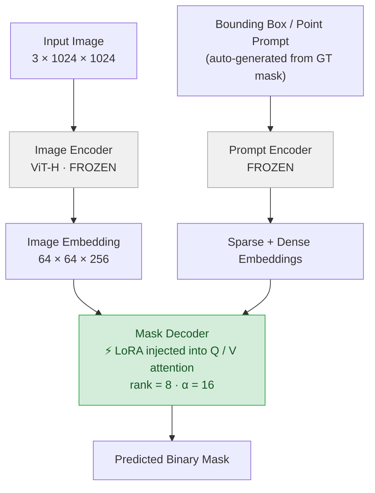

# MedSAM LoRA — Interactive Breast Lesion Segmentation on BUSI

> LoRA-adapted MedSAM achieves **Dice = TBD** on the BUSI test set, outperforming a UNet trained from scratch (Dice = TBD) while using **<1% trainable parameters** and requiring **10× fewer annotated samples** to surpass the UNet baseline.

[](https://github.com/saeid-amini/medai-foundation-finetuning/actions/workflows/lint.yml)
[](https://github.com/saeid-amini/medai-foundation-finetuning/actions/workflows/test.yml)
[](https://github.com/saeid-amini/medai-foundation-finetuning/actions/workflows/docker-build.yml)
[](LICENSE)

---

## Problem Statement

Pixel-accurate lesion delineation in breast ultrasound is a prerequisite for biopsy planning and treatment monitoring, yet acquiring radiologist-annotated masks is expensive and slow. This project asks: **can parameter-efficient fine-tuning (LoRA) of MedSAM — a foundation model pre-trained on 1.5 million medical image–mask pairs — overcome the label scarcity bottleneck while retaining the interactive, bounding-box-prompted workflow required in clinical practice?**

---

## Architecture



**Framework choice:** Vanilla PyTorch + `peft` (not MONAI). The mask decoder's attention layers require gradient-level control for LoRA injection; MONAI does not wrap SAM natively. MONAI is used only for evaluation metrics (`DiceMetric`, `HausdorffDistanceMetric`).

---

## Results

All experiments: BUSI dataset, stratified 80 / 10 / 10 split, 3 random seeds, mean ± std reported.

### Segmentation performance (benign + malignant lesions combined)

| Model | Trainable params | Dice ↑ | HD95 ↓ (px) | IoU ↑ |
|---|---|---|---|---|
| Zero-shot MedSAM | 0 | TBD | TBD | TBD |
| UNet (from scratch) | ~31 M (100%) | TBD | TBD | TBD |
| **MedSAM — Linear probe** | ~0.5 M (0.06%) | TBD | TBD | TBD |
| **MedSAM — LoRA (r=8)** | ~2 M (0.25%) | TBD | TBD | TBD |
| MedSAM — Full fine-tune | ~308 M (100%) | TBD | TBD | TBD |

### Label efficiency (Dice vs. % training data used)

| % labels | UNet scratch | MedSAM LoRA |
|---|---|---|
| 10% | TBD | TBD |
| 20% | TBD | TBD |
| 50% | TBD | TBD |
| 100% | TBD | TBD |

> W&B report: [link TBD]

---

## Reproduce in Three Commands

```bash
# 1. Pull and run the Docker image
docker pull ghcr.io/saeid-amini/medai-foundation-finetuning:latest
docker run --gpus all -v $(pwd)/data:/workspace/data \
           ghcr.io/saeid-amini/medai-foundation-finetuning:latest \
           bash scripts/run_experiments.sh

# 2. Or run locally after setting up the environment
conda env create -f environment.yml && conda activate medai-medsam
pip install -e .

# 3. Train and evaluate
python -m medai_medsam.train experiment=lora_r8
python -m medai_medsam.eval  checkpoint=results/checkpoints/lora_r8_best.pth
```

---

## Data Access

**Dataset:** BUSI — Breast Ultrasound Images Dataset (Al-Dhabyani et al., 2020)  
**Source:** [scholar.cu.edu.eg — BUSI dataset](https://scholar.cu.edu.eg/?q=afahmy/pages/dataset)  
**License:** Free for academic use. No DUA required. Direct download.  
**Size:** 780 images + masks (3 classes: benign 437, malignant 210, normal 133)  
**Format:** PNG images + PNG masks

```bash
bash scripts/download_data.sh   # downloads and extracts to data/BUSI/
```

**MedSAM weights:** Download `medsam_vit_b.pth` from the [MedSAM HuggingFace Hub](https://huggingface.co/wanglab/medsam-vit-base). Place at `checkpoints/medsam_vit_b.pth`. File is ~375 MB. Not included in this repository.

---

## Limitations and Intended Use

- **Not a medical device.** No model in this repository has been validated for clinical use. Do not use predictions to guide clinical decisions.
- **Dataset scope.** BUSI contains 780 images from a single institution (Cairo University Hospital). Performance on out-of-distribution scanners, patient populations, or acquisition protocols is unknown.
- **Prompt dependency.** MedSAM requires a bounding-box or point prompt. Evaluation here uses bounding boxes derived from ground-truth masks; real clinical performance will depend on prompt quality.
- **Benign/malignant imbalance.** BUSI is moderately imbalanced. Stratified sampling is used, but minority-class metrics should be interpreted cautiously.
- **LoRA rank sensitivity.** Results are reported for rank=8. Other ranks were not exhaustively searched.

---

## Citation

If you use this code in your research, please cite:

```bibtex
@software{amini2026medsam_lora,
  author    = {Amini, Saeid},
  title     = {MedSAM LoRA: Parameter-Efficient Fine-Tuning of MedSAM for Interactive Breast Lesion Segmentation},
  year      = {2026},
  url       = {https://github.com/saeid-amini/medai-foundation-finetuning},
  license   = {MIT}
}

@article{ma2024medsam,
  title     = {Segment anything in medical images},
  author    = {Ma, Jun and He, Yuting and Li, Feifei and Han, Lin and You, Chenyu and Wang, Bo},
  journal   = {Nature Communications},
  volume    = {15},
  year      = {2024},
  doi       = {10.1038/s41467-024-44824-z}
}

@inproceedings{hu2022lora,
  title     = {LoRA: Low-Rank Adaptation of Large Language Models},
  author    = {Hu, Edward J. and Shen, Yelong and Wallis, Phillip and Allen-Zhu, Zeyuan and Li, Yuanzhi and Wang, Shean and Wang, Lu and Chen, Weizhu},
  booktitle = {International Conference on Learning Representations (ICLR)},
  year      = {2022}
}
```

---

## Related Work

| Paper | Venue | One-line description |
|---|---|---|
| Ma et al., **MedSAM** | *Nature Commun.* 2024 | Fine-tunes SAM on 1.5M medical image–mask pairs; establishes the foundation model this project adapts. |
| Hu et al., **LoRA** | ICLR 2022 | Low-rank adaptation: inject trainable rank-decomposition matrices into attention layers, keeping base weights frozen. |
| Kirillov et al., **SAM** | ICCV 2023 | Segment Anything Model — the ViT-H backbone that MedSAM builds on. |
| Al-Dhabyani et al., **BUSI** | *Data in Brief* 2020 | The breast ultrasound dataset used for evaluation; 780 images with expert-annotated masks. |
| Zhang & Liu, **SAMed** | arXiv 2023 | Concurrent work applying LoRA to SAM for medical segmentation; key baseline for comparison. |

---

## Repository Structure

```
medai-foundation-finetuning/
├── src/medai_medsam/       # importable Python package
│   ├── data/               # BUSI dataset class, transforms, download
│   ├── models/             # MedSAM wrapper, LoRA injection, UNet baseline
│   ├── losses/             # DiceLoss, BCEDiceLoss
│   ├── metrics/            # Dice, HD95, IoU wrappers
│   ├── explainability/     # GradCAM on decoder, attention visualization
│   ├── train.py            # Hydra-configured training entry point
│   └── eval.py             # Evaluation and result export
├── configs/                # Hydra YAML configs (train, eval, model variants)
├── scripts/                # download_data.sh, run_experiments.sh
├── docker/                 # Dockerfile
├── tests/                  # pytest suite (≥10 tests)
├── notebooks/exploration/  # cleaned exploratory notebooks
├── results/                # metrics CSV, figures, W&B run links
└── .github/workflows/      # lint, test, docker-build CI
```
